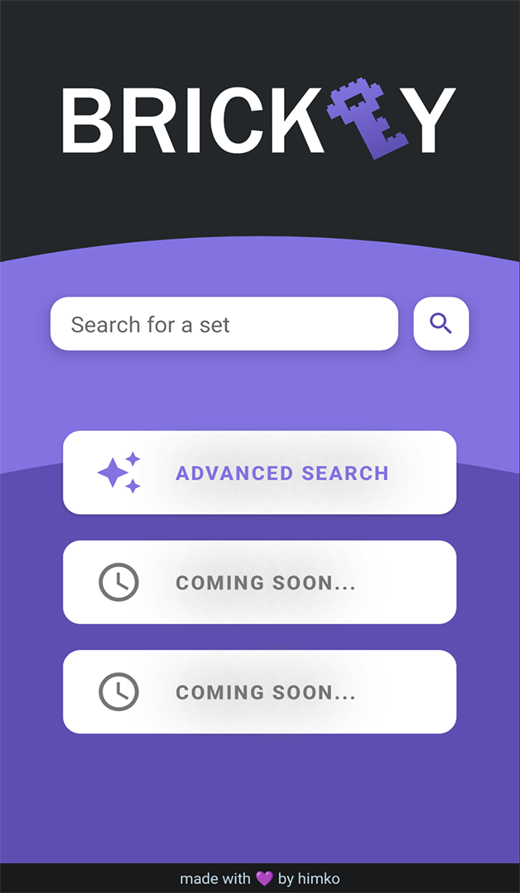
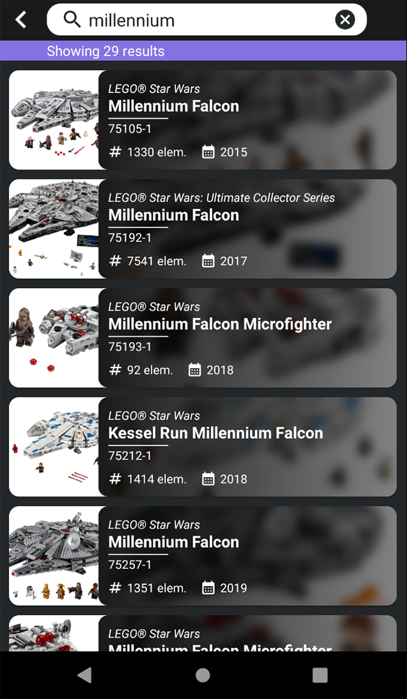
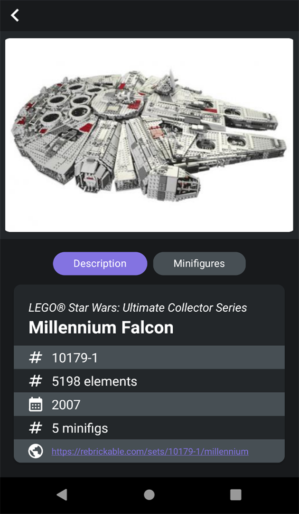

# brickey

  

LEGO® sets catalogue Android app made in Kotlin using [Rebrickable API]. Made as a final project for a mobile development university course. Enjoy! 

## Gallery

Home Fragment              | Search Results Fragment              | Set Details Fragment
:-------------------------:|:------------------------------------:|:---------------------------------:
 |  | 

[Rebrickable API]: https://rebrickable.com/api/
